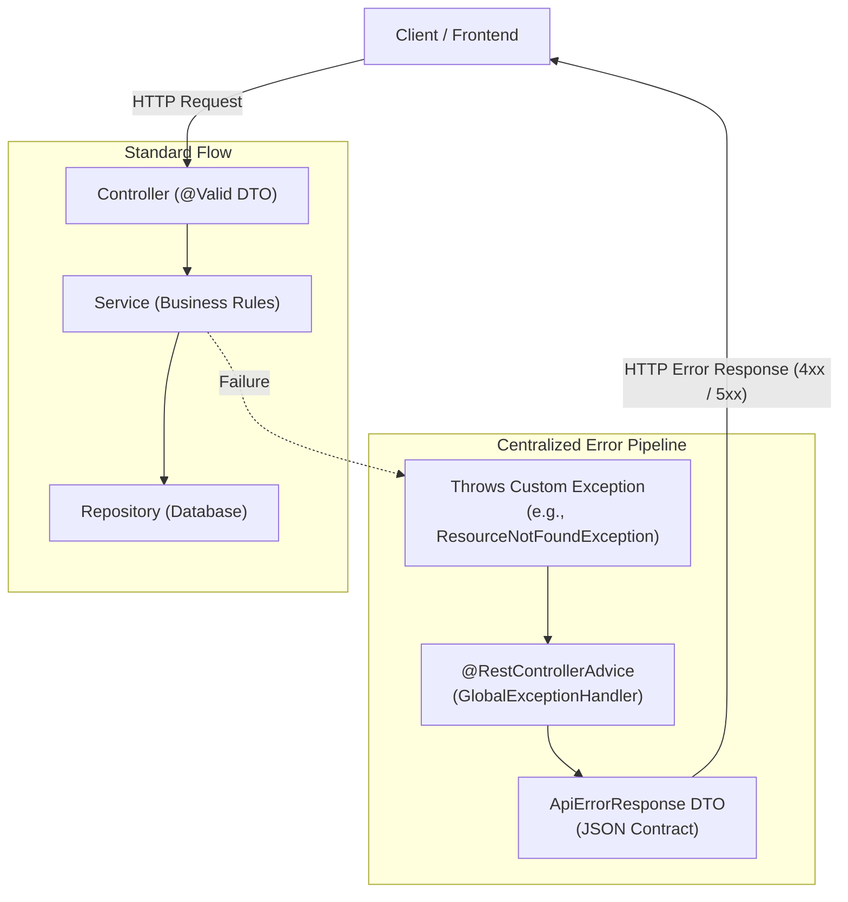

# CampusHub — Backend API Foundation: Hands-on Learning Roadmap

> **Target Audience:** Beginner to Intermediate Spring Boot / Java Developers  
> **Source Specification:** [CampusHub_Backend_API_Foundation.md](CampusHub_Backend_API_Foundation.md)  
> **Approach:** Concept Explanation $\rightarrow$ Code Implementation $\rightarrow$ Integrated MockMvc Testing

---

## 📌 Table of Contents
1. [Overview & Learning Objectives](#1-overview--learning-objectives)
2. [Architectural Mental Model](#2-architectural-mental-model)
3. [Phase 1: API Error Contract & Custom Exceptions](#phase-1-api-error-contract--custom-exceptions)
4. [Phase 2: Centralized Exception Handling & Validation Mapping](#phase-2-centralized-exception-handling--validation-mapping)
5. [Phase 3: JPA Audit Timestamp Foundation (`BaseEntity`)](#phase-3-jpa-audit-timestamp-foundation-baseentity)
6. [Phase 4: Security Standardization (401 / 403) & Backend Conventions](#phase-4-security-standardization-401--403--backend-conventions)
7. [Testing Strategy with MockMvc](#7-testing-strategy-with-mockmvc)
8. [Definition of Done & Progress Checklist](#8-definition-of-done--progress-checklist)

---

## 1. Overview & Learning Objectives

Before implementing business features (**Profile**, **Community**, **Marketplace**, **Lost & Found**), CampusHub requires a shared, robust backend foundation.

### Key Objectives to Master:
- **Consistent API Contract:** Guarantee that every error (client mistake, business conflict, or server crash) produces an identical, predictable JSON structure.
- **Clean Architecture:** Keep Controllers free of business logic and Services free of HTTP status codes. Services throw semantic exceptions; the framework formats the response.
- **Information Hiding:** Never leak SQL syntax, table schemas, or framework stack traces to external users on `500 Internal Server Error`.
- **Field-Level Validation:** Transform Bean Validation annotations (`@NotBlank`, `@Email`, etc.) into user-friendly field-error maps for frontend display.
- **Automated Verification:** Write tests using `MockMvc` after each feature to confirm HTTP status codes, headers, and JSON structure.

---

## 2. Architectural Mental Model

### Request & Error Flow Diagram



### The Standard Error JSON Contract
```json
{
  "status": 400,
  "error": "VALIDATION_ERROR",
  "message": "Request validation failed",
  "fields": {
    "email": "Invalid email address format",
    "password": "Password must be at least 8 characters"
  },
  "timestamp": "2026-10-02T10:15:30"
}
```

---

## Phase 1: API Error Contract & Custom Exceptions

### 🎯 Goal
Define the data contract for all backend errors and create semantic Java runtime exceptions.

### 📚 Concepts to Learn
1. **DTOs (Data Transfer Objects):** Why we use dedicated DTOs for error responses instead of sending generic Maps or internal Java Exceptions.
2. **`RuntimeException` vs Checked `Exception`:** Why Spring's transaction management and service layers rely on unchecked runtime exceptions.
3. **HTTP Status Code Mapping:**
   - `400 Bad Request`: Malformed syntax or generic invalid input.
   - `404 Not Found`: A requested resource (User, Post, Item) does not exist in the database.
   - `409 Conflict`: Business rule conflicts (e.g., duplicate email, item already reserved).

### 🛠️ Tasks & File Deliverables

#### 1. Package Structure Setup
Create the following package folders under `backend/src/main/java/com/campushub/`:
```text
com.campushub/
├── common/
│   ├── dto/
│   │   └── ApiErrorResponse.java
│   └── exception/
│       ├── ResourceNotFoundException.java
│       ├── ConflictException.java
│       └── BadRequestException.java
```

#### 2. Implement `ApiErrorResponse.java`
- Fields:
  - `private int status;` (e.g. 404)
  - `private String error;` (e.g. `"RESOURCE_NOT_FOUND"`)
  - `private String message;` (e.g. `"User not found with id 123"`)
  - `private Map<String, String> fields;` (Nullable / omitted when not a validation error)
  - `private LocalDateTime timestamp;` (Defaults to `LocalDateTime.now()`)
- Add convenient builder/factory methods:
  ```java
  public static ApiErrorResponse of(int status, String error, String message) { ... }
  public static ApiErrorResponse of(int status, String error, String message, Map<String, String> fields) { ... }
  ```

#### 3. Implement Custom Semantic Exceptions
- `ResourceNotFoundException.java` (extends `RuntimeException`)
- `ConflictException.java` (extends `RuntimeException`)
- `BadRequestException.java` (extends `RuntimeException`)

### 🧪 Integrated Testing Task
- Create `backend/src/test/java/com/campushub/common/dto/ApiErrorResponseTest.java`.
- Write unit tests to verify:
  1. Factory methods correctly populate all fields.
  2. Timestamp is automatically generated.
  3. `fields` map can be null for non-validation errors.

---

## Phase 2: Centralized Exception Handling & Validation Mapping

### 🎯 Goal
Create `@RestControllerAdvice` to intercept exceptions globally, map Bean Validation errors to field maps, and sanitize `500 Internal Server Errors`.

### 📚 Concepts to Learn
1. **Spring AOP & `@RestControllerAdvice`:** How Spring intercepts exceptions thrown out of controller methods.
2. **`@ExceptionHandler`:** Routing specific exception classes (`ResourceNotFoundException`, `MethodArgumentNotValidException`, etc.) to dedicated handler methods.
3. **Bean Validation (`jakarta.validation`):** Using `@Valid`, `@NotBlank`, `@Email`, `@Size` on request DTOs.
4. **BindingResult:** Extracting `FieldError` lists and converting them into a clean `Map<String, String>`.
5. **Information Hiding:** Catching uncaught `Exception.class` or `Throwable`, logging the full stack trace internally using SLF4J/Logback, but hiding internal database/code details from the HTTP response.

### 🛠️ Tasks & File Deliverables

#### 1. Implement `GlobalExceptionHandler.java`
Create in `com.campushub.common.exception.GlobalExceptionHandler`:

```java
@RestControllerAdvice
public class GlobalExceptionHandler {
    private static final Logger log = LoggerFactory.getLogger(GlobalExceptionHandler.class);

    // 1. 404 - Resource Not Found
    @ExceptionHandler(ResourceNotFoundException.class)
    public ResponseEntity<ApiErrorResponse> handleNotFound(ResourceNotFoundException ex) { ... }

    // 2. 409 - Business Conflict
    @ExceptionHandler(ConflictException.class)
    public ResponseEntity<ApiErrorResponse> handleConflict(ConflictException ex) { ... }

    // 3. 400 - Bad Request
    @ExceptionHandler(BadRequestException.class)
    public ResponseEntity<ApiErrorResponse> handleBadRequest(BadRequestException ex) { ... }

    // 4. 400 - Validation Errors (@Valid)
    @ExceptionHandler(MethodArgumentNotValidException.class)
    public ResponseEntity<ApiErrorResponse> handleValidation(MethodArgumentNotValidException ex) { ... }

    // 5. 500 - Unexpected Server Errors
    @ExceptionHandler(Exception.class)
    public ResponseEntity<ApiErrorResponse> handleUnexpected(Exception ex) {
        log.error("Unhandled exception caught: ", ex);
        // Return generic message, NEVER ex.getMessage() or stack trace!
    }
}
```

### 🧪 Integrated Testing Task
- Create a test controller `TestDummyController.java` inside `src/test/java` containing endpoints that deliberately throw each exception and accept an `@Valid` DTO.
- Write `GlobalExceptionHandlerTest.java` using `@WebMvcTest` and `MockMvc`:
  - Verify `400` validation returns `{"status": 400, "error": "VALIDATION_ERROR", "fields": {"email": ...}}`.
  - Verify `404` returns `RESOURCE_NOT_FOUND`.
  - Verify `409` returns `CONFLICT`.
  - Verify `500` returns `INTERNAL_SERVER_ERROR` and does NOT contain SQL or stack trace strings.

---

## Phase 3: JPA Audit Timestamp Foundation (`BaseEntity`)

### 🎯 Goal
Eliminate boilerplate across future database entities by providing an automatic timestamp audit superclass.

### 📚 Concepts to Learn
1. **`@MappedSuperclass`:** Allowing entity classes to inherit properties and column mappings from a base class without creating a separate table.
2. **Spring Data JPA Auditing:** How `@EntityListeners(AuditingEntityListener.class)` automatically injects timestamps upon insert (`@CreatedDate`) and update (`@LastModifiedDate`).
3. **`@EnableJpaAuditing`:** Enabling auditing via a configuration class.

### 🛠️ Tasks & File Deliverables

#### 1. Implement `BaseEntity.java`
Create in `com.campushub.common.entity.BaseEntity`:
```java
@MappedSuperclass
@EntityListeners(AuditingEntityListener.class)
public abstract class BaseEntity {

    @CreatedDate
    @Column(name = "created_at", nullable = false, updatable = false)
    private LocalDateTime createdAt;

    @LastModifiedDate
    @Column(name = "updated_at", nullable = false)
    private LocalDateTime updatedAt;

    // Getters and Setters
}
```

#### 2. Create `JpaConfig.java`
Create in `com.campushub.config.JpaConfig`:
```java
@Configuration
@EnableJpaAuditing
public class JpaConfig {
}
```

### 🧪 Integrated Testing Task
- Write a `@DataJpaTest` using a temporary entity (e.g. `TestEntity extends BaseEntity`).
- Assert that saving an entity automatically populates `createdAt` and `updatedAt`.
- Assert that updating the entity modifies `updatedAt` while keeping `createdAt` intact.

---

## Phase 4: Security Standardization (401 / 403) & Backend Conventions

### 🎯 Goal
Standardize `401 Unauthorized` and `403 Forbidden` responses within the Spring Security filter chain and document team backend conventions.

### 📚 Concepts to Learn
1. **The Servlet Filter Chain:** Why security failures occur before Spring MVC's `@RestControllerAdvice` can catch them.
2. **`AuthenticationEntryPoint`:** Intercepting unauthenticated requests (missing or invalid JWT/token $\rightarrow$ 401).
3. **`AccessDeniedHandler`:** Intercepting authenticated requests with insufficient privileges $\rightarrow$ 403.
4. **Writing directly to `HttpServletResponse`:** Serializing `ApiErrorResponse` via Jackson `ObjectMapper`.

### 🛠️ Tasks & File Deliverables

#### 1. Implement Security Handlers
Create under `com.campushub.security/`:
- `RestAuthenticationEntryPoint.java` (Implements `AuthenticationEntryPoint`)
- `RestAccessDeniedHandler.java` (Implements `AccessDeniedHandler`)

#### 2. Document Conventions
Create `docs/backend-conventions.md` summarizing:
- Layering: Controller $\rightarrow$ Service $\rightarrow$ Repository.
- DTO vs Entity separation rules.
- Centralized exception guidelines (no custom error formats in feature modules).

### 🧪 Integrated Testing Task
- Write `SecurityErrorHandlingTest.java` using `MockMvc`.
- Test that accessing a protected endpoint without auth returns HTTP 401 with standard `ApiErrorResponse`.
- Test that accessing with insufficient permissions returns HTTP 403 with standard `ApiErrorResponse`.

---

## 7. Testing Strategy with MockMvc

For every endpoint and exception, verify three core aspects:

```java
mockMvc.perform(get("/api/test/not-found"))
    .andExpect(status().isNotFound())
    .andExpect(jsonPath("$.status").value(404))
    .andExpect(jsonPath("$.error").value("RESOURCE_NOT_FOUND"))
    .andExpect(jsonPath("$.message").isNotEmpty())
    .andExpect(jsonPath("$.timestamp").exists());
```

### Key Maven Commands:
```bash
# Run all tests in the backend module
cd backend
./mvnw test

# Run a specific test class
./mvnw test -Dtest=GlobalExceptionHandlerTest
```

---

## 8. Definition of Done & Progress Checklist

Track your progress through this roadmap:

### Phase 1: Contract & Exceptions
- [ ] `ApiErrorResponse.java` created with status, error, message, fields, timestamp.
- [ ] `ResourceNotFoundException.java` created.
- [ ] `ConflictException.java` created.
- [ ] `BadRequestException.java` created.
- [ ] Unit tests for `ApiErrorResponse` passing.

### Phase 2: Centralized Exception Handling & Validation
- [ ] `GlobalExceptionHandler.java` implemented with `@RestControllerAdvice`.
- [ ] 404 `ResourceNotFoundException` handled.
- [ ] 409 `ConflictException` handled.
- [ ] 400 `BadRequestException` handled.
- [ ] 400 `MethodArgumentNotValidException` mapped to field error dictionary.
- [ ] 500 `Exception` safely handled (no stack traces or SQL leaked).
- [ ] `MockMvc` tests passing for all error scenarios.

### Phase 3: JPA Audit Foundation
- [ ] `BaseEntity.java` implemented with `@CreatedDate` and `@LastModifiedDate`.
- [ ] `JpaConfig.java` created with `@EnableJpaAuditing`.
- [ ] `@DataJpaTest` passing for auditing timestamps.

### Phase 4: Security Standardization & Documentation
- [ ] `RestAuthenticationEntryPoint` implemented (401).
- [ ] `RestAccessDeniedHandler` implemented (403).
- [ ] `docs/backend-conventions.md` written.
- [ ] Full backend test suite (`./mvnw test`) passes with zero failures.
